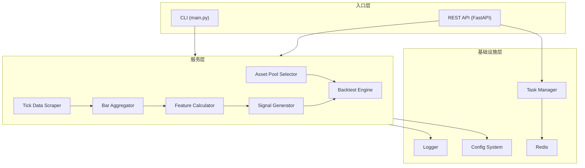
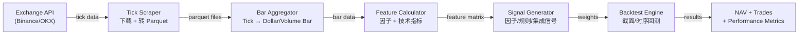

# Crypto Data Engine — 系统架构

## 概览

Crypto Data Engine 是一个端到端的加密货币量化交易数据引擎，覆盖从 tick 数据采集、bar 聚合、因子计算、信号生成到回测验证的完整流程。

---

## 系统架构图



---

## 模块说明

### 入口层

| 模块 | 文件 | 说明 |
|------|------|------|
| **CLI** | `src/crypto_data_engine/main.py` | Typer CLI，支持 `serve`、`aggregate`、`features`、`backtest` 等命令 |
| **REST API** | `src/crypto_data_engine/api/` | FastAPI 应用，提供回测、策略、可视化、下载、聚合端点 |

### 服务层

| 模块 | 路径 | 说明 |
|------|------|------|
| **Tick Data Scraper** | `services/tick_data_scraper/` | 多交易所 tick 数据下载，支持 Binance Spot/Futures、OKX |
| **Asset Pool** | `services/asset_pool/` | 动态资产池选择器，按成交额筛选 Top-N 交易对 |
| **Bar Aggregator** | `services/bar_aggregator/` | 将 tick 数据聚合为 time/tick/volume/dollar bar，含 Numba 加速 |
| **Feature Calculator** | `services/feature/` | 计算收益率、波动率、动量、alpha 因子等特征 |
| **Signal Generator** | `services/signal_generation/` | 因子信号、规则信号、集成信号生成 |
| **Backtest Engine** | `services/back_test/` | 截面/时序回测引擎，含组合管理、风控、成本模型 |

### 基础设施层

| 模块 | 路径 | 说明 |
|------|------|------|
| **Task Manager** | `common/task_manager.py` | 轻量级任务调度，线程池 + 进程池，支持 Redis/内存存储 |
| **Logger** | `common/logger/` | Loguru 日志系统，按模块/服务分级 |
| **Config** | `common/config/` | Pydantic + YAML 配置系统 |
| **Core Types** | `core/` | 基础类型定义（策略接口、交易记录等） |

---

## 数据流



### 典型回测流程

1. **资产池选择** — `AssetPoolSelector` 查询 Binance API，按成交额选择 Top-N 交易对
2. **Bar 聚合** — 从 parquet tick 文件聚合为 1h time bar（或其他类型）
3. **因子计算** — `UnifiedFeatureCalculator` 计算 ~100 个特征列
4. **回测执行** — `CrossSectionalEngine` 按周再平衡，动量排名选股，Long/Short 各 N 个
5. **结果验证** — 输出 NAV 曲线、交易记录、Sharpe/MaxDD 等指标

---

## 目录结构

```
src/crypto_data_engine/
├── api/                          # REST API (FastAPI)
│   ├── main.py                   # App 入口 + CORS + 路由注册
│   ├── routers/
│   │   ├── aggregation.py        # Bar 聚合端点
│   │   ├── backtest.py           # 回测端点
│   │   ├── download.py           # 数据下载端点
│   │   ├── strategy.py           # 策略端点
│   │   └── visualization.py      # 可视化端点
│   ├── schemas/                  # Pydantic 请求/响应模型
│   │   ├── backtest.py
│   │   ├── common.py
│   │   ├── download.py
│   │   └── strategy.py
│   └── storage.py                # 回测结果存储
│
├── common/                       # 共享基础设施
│   ├── config/
│   │   ├── config_settings.py    # 配置类定义
│   │   ├── config_utils.py       # YAML 加载/模板生成
│   │   ├── aggregation_config.py
│   │   ├── downloader_config.py
│   │   ├── task_config.py
│   │   └── paths.py
│   ├── logger/
│   │   └── logger.py             # Loguru 日志管理
│   ├── task_manager.py           # 任务调度器
│   └── utils/
│       └── setting_utils.py
│
├── core/                         # 核心类型定义
│   ├── base.py                   # BaseStrategy, TradeRecord, BacktestResult 等
│   └── interfaces.py             # IPortfolio, IRiskManager 等接口
│
├── services/                     # 业务服务
│   ├── asset_pool/               # 资产池选择
│   ├── bar_aggregator/           # Bar 聚合
│   │   ├── bar_types.py          # BarType, builders
│   │   ├── fast_aggregator.py    # Numba 加速
│   │   ├── feature_calculator.py # Bar 特征
│   │   └── unified.py            # 统一入口
│   ├── feature/                  # 因子特征
│   │   ├── Factor.py             # Alpha 因子库
│   │   └── unified_features.py   # 统一计算器
│   ├── signal_generation/        # 信号生成
│   │   ├── base.py
│   │   ├── factor_signal.py
│   │   ├── rule_signal.py
│   │   └── ensemble.py
│   ├── back_test/                # 回测引擎
│   │   ├── config.py             # 回测配置
│   │   ├── factory.py            # 工厂函数
│   │   ├── engine/               # CS/TS 引擎实现
│   │   ├── portfolio/            # 组合管理
│   │   ├── strategies/           # 策略实现
│   │   ├── trading_log.py        # 交易日志
│   │   ├── visualization.py      # 图表生成
│   │   ├── data_loader.py        # 数据加载
│   │   └── asset_selector.py     # 回测内资产筛选
│   └── tick_data_scraper/        # Tick 数据下载
│       ├── downloader/           # 下载器 + 交易所适配器
│       ├── extractor/            # 解压转换
│       └── tick_worker.py        # 下载流程编排
│
├── main.py                       # CLI 入口 (Typer)
│
scripts/
└── run_real_backtest.py          # 端到端回测脚本

deploy/
├── Dockerfile
└── docker-compose.yml            # Redis + API

docs/
├── API.md                        # API 参考文档
└── ARCHITECTURE.md               # 本文档
```

---

## 部署

### Docker Compose（推荐）

```bash
cd deploy
docker compose up -d
```

服务组成：
- **Redis** — 任务状态存储（端口 6379）
- **API Server** — FastAPI 应用（端口 8000）

### 本地开发

```bash
# 安装依赖
poetry install

# 启动开发服务器
poetry run crypto-engine dev

# 或仅 API
poetry run crypto-engine serve --reload
```

---

## 技术栈

| 组件 | 技术 |
|------|------|
| Web 框架 | FastAPI + Uvicorn |
| CLI | Typer |
| 数据处理 | Pandas, NumPy |
| 加速 | Numba (JIT) |
| 配置 | Pydantic + YAML |
| 日志 | Loguru |
| 缓存/队列 | Redis |
| 任务调度 | 自建 TaskManager (线程池 + 进程池) |
| 容器化 | Docker + Docker Compose |
